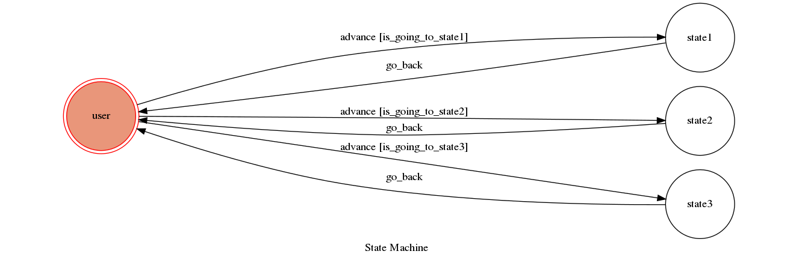

# TOC2018
## Finite State Machine

## Usage

* user
	* Input: "1"
		* Reply: "I'm entering state1"

	* Input: "2"
		* Reply: "I'm entering state1"
		
	* Input: "3"
		* Reply: "I'm entering state3"
		
	* Input: "4"
		* Reply: "I'm entering state4"

